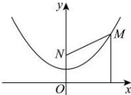

> [!faq]- 全练一本通解析
> **【答案】** $y=\frac{1}{4}x^{2}+1$
>
> **【解析】**
> 设 $M(x,y)$ ，依题意，得 $\left|y\right|=\sqrt{x^{2}+\left(y-2\right)^{2}}$ ，
> 化简得 $y=\frac{1}{4}x^{2}+1$ ，故动点 M 的方程为 $y=\frac{1}{4}x^{2}+1$
> 
