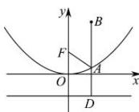

> [!faq]- 全练一本通解析
> **【答案】** B
>
> **【解析】**
> 解析:设点 A 在准线上的射影为 D, 如图,
> 则根据抛物线的定义可知 $\left|AF\right|=\left|AD\right|$
> 求 $\left|AB\right|+\left|AF\right|$ 的最小值, 即求 $\left|AB\right|+\left|AD\right|$ 的最小值,
> 显然当 $D, B, A$ 三点共线时 $\left|AB\right| + \left|AD\right|$ 最小，
> 此时 A 点的横坐标为 1, 代入抛物线方程可知 $A\left(1,\frac{1}{4}\right)$ . 故选: B.
> 
