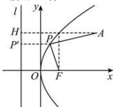

> [!faq]- 全练一本通解析
> **【答案】** A
>
> **【解析】**
> 解析:由抛物线 $y^{2}=4x$ 知 p=2，则 $F(1,0)$ ，准线 l 方程为 x=-1。
> 如图所示, 点 A 在抛物线内, 过点 P 作抛物线准线 l 的垂线段, 垂足为点 $P'$ ,
> $$
> A H \perp l
> $$
> 
> 由抛物线的定义得 $\left|PF\right|=\left|PP'\right|$ ，所以 $\left|PA\right|+\left|PF\right|=\left|PA\right|+\left|PP'\right|\geq\left|AH\right|$ ，当且仅当点P是线段AH与抛物线的交点（即A,P,H三点共线）时取等号.故 $\left|PA\right|+\left|PF\right|$ 的最小值为 $\left|AH\right|=3+\frac{p}{2}=4$ .
>
> 故选 **A**
