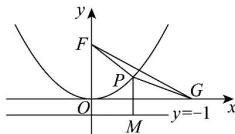

> [!faq]- 全练一本通解析
> **【答案】** A
>
> **【解析】**
> 解析:由抛物线 $C: x^{2} = 12y$ 可知其焦点为 $(0,3)$ ，准线方程为 y = -3 记抛物线 C 的焦点为 $F(0,3)$ ，
> 所以 $\left|PG\right| + \left|PM\right| = \left|PG\right| + \left|PF\right| - 2 \geq \left|FG\right| - 2 = \sqrt{4^2 + 3^2} - 2 = 3$
> 当且仅当点 P 在线段 FG 上时等号成立,
> 所以 $\left|PG\right|+\left|PM\right|$ 的最小值为 3. 故选: A.
> 
