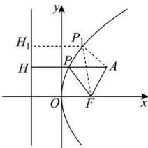

> [!faq]- 全练一本通解析
> **【答案】** C
>
> **【解析】**
> 解析:由题意,抛物线的准线 x=-2, 过点 P 作 PH 垂直于准线且交准线于 H, 则 $\left|PF\right|=\left|PH\right|$ ,
> 
> 由题可知， $\triangle PAF$ 的周长为 $\left|AF\right| + \left|PA\right| + \left|PF\right| = \left|AF\right| + \left|PA\right| + \left|PH\right|$ ，又 $\left|AF\right| = \sqrt{5}$ ，
> 如图， $\left|AF\right| + \left|PA\right| + \left|PH\right|\geq \left|AF\right| + \left|AH\right|$ ，当 $A,P,H$ 三点共线时，
> $\triangle PAF$ 的周长最小, 且最小值为 $5 + \sqrt{5}$ .
>
> 故选 **C**.
