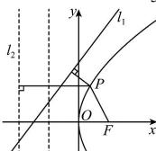

> [!faq]- 全练一本通解析
> **【答案】** D
>
> **【解析】**
> 解析:由题可知 x=-1 是抛物线 $y^{2}=4x$ 的准线,
> 设抛物线的焦点为 F，则 $F(1,0)$ ,
> 所以动点 P 到 $l_{2}$ 的距离等于 P 到 x=-1 的距离加 1，
> 即动点 P 到 $l_{2}$ 的距离等于 $\left|PF\right|+1$ 所以动点 P 到直线 $l_{1}$ 和直线 $l_{2}$ 的距离之和的最小值为焦点 F 到直线 $l_{1}:4x-3y+6=0$ 的距离加 1，
> 即其最小值是 $\frac{|4-0+6|}{5}+1=3$ . 故选:D
> 
