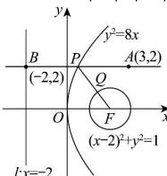

> [!faq]- 全练一本通解析
> **【答案】** 4
>
> **【解析】**
> 如图所示:
> 抛物线 $y^{2}=8x$ 的焦点 $F(2,0)$ ，准线 l:x=-2
> 圆 $(x - 2)^{2} + y^{2} = 1$ 的圆心为 $F(2,0)$ ，半径 $r = 1$
> 过点 P 作 PB 垂直准线 l，垂直为点 B，
> 由抛物线的定义可知 $\left|PB\right|=\left|PF\right|$
> $$
> \left| P A \right| + \left| P Q \right| = \left| P A \right| + \left| P F \right| - r = \left| P A \right| + \left| P F \right| - 1 = \left| P A \right| + \left| P B \right| - 1 \geq \left| A B \right| - 1 = 3 + 2 - 1 = 4
> $$
> 当且仅当 B, P, A 三点共线时, 等号成立,
> 综上所述： $\left|PA\right|+\left|PQ\right|$ 的最小值为 4.
> 
