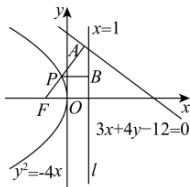

> [!faq]- 全练一本通解析
> **【答案】** B
>
> **【解析】**
> 解析: 抛物线 $y^{2} = -4x$ 的焦点 $F(-1,0)$ ，准线 l: x = 1，
> 过点 P 作 $PB \perp l$ 于 B，PA 垂直于直线 $3x + 4y - 12 = 0$ 于点 A，显然 $|PB| = |FP|$ ,
> 点 F 到直线 $3x + 4y - 12 = 0$ 的距离 $d = \frac{|-1 \times 3 - 12|}{\sqrt{3^2 + 4^2}} = 3$ 则 $d_{1}+d_{2}=|PB|-1+|PA|=|FP|+|PA|-1\geq d-1=2$ 当且仅当点 P 是点 F 到直线 $3x + 4y - 12 = 0$ 的垂线段与抛物线的交点时取等号，
> 所以 $d_{1} + d_{2}$ 的最小值为 2. 故选：B
> 
