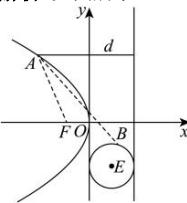

> [!faq]- 全练一本通解析
> **【解析】**
> $2\sqrt{2}$
> 解析:如图所示:
> 
> 由圆 E 的标准方程为 $(x-1)^{2}+(y+2)^{2}=1$ 可知圆心 $E(1,-2)$ ，半径为 r=1，
> 抛物线 C 的焦点为 $F(-1,0)$ ，准线方程为 x=1，
> 由抛物线定义可知 $\left|AF\right|=d-1$ 圆外一点到圆上点的距离满足 $\left|AE\right|-r\leq\left|AB\right|\leq\left|AE\right|+r$ ，即 $\left|AE\right|-1\leq\left|AB\right|\leq\left|AE\right|+1$ ;
> 所以 $\left|AB\right|+d=\left|AB\right|+\left|AF\right|+1\geq\left|AE\right|-1+\left|AF\right|+1=\left|AE\right|+\left|AF\right|\geq\left|EF\right|=2\sqrt{2}$ 当且仅当 A,E,F 三点共线时，等号成立；
> 即 $\left|AB\right|+d$ 的最小值为 $2\sqrt{2}$ .
