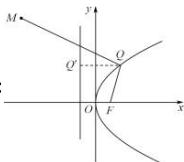

> [!faq]- 全练一本通解析
> **【解析】**
> $\frac{5}{2}$
> 解析：
> 
> 抛物线的准线方程为 $x = -\frac{1}{2}$ ,
> 过点 $Q$ 作 $QQ'$ 垂直准线于点 $Q'$
> $$
> \left| M Q \right| - \left| Q F \right| = \left| M Q \right| - \left| Q Q ^ {\prime} \right|
> $$
> 显然, 当 MQ 平行于 x 轴时,
> $\left|MQ\right| - \left|QF\right|$ 取得最小值，此时 $Q(2,2)$ ，
> 此时 $\left|MQ\right|-\left|QF\right|=\left|2+3\right|-\left|2+\frac{1}{2}\right|=\frac{5}{2}$ 故答案为: $\frac{5}{2}$ .
