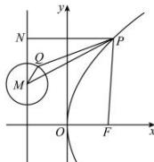

> [!faq]- 全练一本通解析
> **【答案】** B
>
> **【解析】**
> 解析:如图, 过点 P 作 $PN \perp l$ 于点 N, 根据抛物线的定义可得: $\left|PF\right| = \left|PN\right|$ ,
> 
> 所以 $|PF| - |PQ| = |PN| - |PQ|$ ，而 $|PQ| \geq |PM| - |QM| = |PM| - 1$
> 所以 $|PF| - |PQ| = |PN| - |PQ|\leq |PN| - |PM| + 1\leq 1$
> 当且仅当点 Q、点 N、点 M 在同一条直线上时等号成立，
> 所以 $|PF| - |PQ|$ 有最大值1.
>
> 故选 **B**
