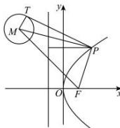

> [!faq]- 全练一本通解析
> **【答案】** $4\sqrt{2}-1$
>
> **【解析】**
> 由题意可得:抛物线 $y^{2}=4x$ 的焦点为 $F(1,0)$ ，准线为直线 l: x=-1，
> 圆 $M:\left(x+3\right)^{2}+\left(y-4\right)^{2}=1$ 的圆心 $M(-3,4)$ ，半径 r=1，
> 由抛物线的定义知， $d=\left|PF\right|$ ，则 $\left|PT\right|+d=\left|PT\right|+\left|PF\right|\geq\left|PM\right|-r+\left|PF\right|\geq\left|MF\right|-r$ 当 P, F, M 三点共线时，取最小值为 $\left|MF\right|-1=\sqrt{\left(1-(-3)\right)^{2}+\left(0-4\right)^{2}}-1=4\sqrt{2}-1.$
> 故答案为： $4\sqrt{2} - 1$
> 
