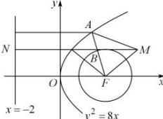

> [!faq]- 全练一本通解析
> **【解析】**
> 4
> 解析:由抛物线 $C_{1}:y^{2}=8x$ 得焦点 $F(2,0)$ ，准线为 x=-2，
> 由圆 $C_{2}:x^{2}+y^{2}-4x+3=0$ ，得 $(x-2)^{2}+y^{2}=1$ ，
> 所以圆 $C_{2}$ 是以 $F(2,0)$ 为圆心，以 r=1 为半径的圆，
> 所以 $\left|AM\right|+\left|AB\right|\geq\left|AM\right|+\left|AF\right|-1$ 所以当 $\left|AM\right|+\left|AF\right|$ 取得最小值时， $\left|AM\right|+\left|AB\right|$ 取得最小值，
> 又根据抛物线的定义得 $\left|AF\right|$ 等于点 A 到准线 x=-2 的距离，
> 所以过点 M 作准线 x=-2 的垂线，垂足为 N，且与抛物线 $C_{1}:y^{2}=8x$ 相交，当点 A 为此交点时， $\left|AM\right|+\left|AF\right|$ 取得最小值，最小值为 $\left|3-(-2)\right|=5$ ，
> 所以此时 $\left|AM\right|+\left|AB\right|\geq\left|AM\right|+\left|AF\right|-1\geq5-1=4$ 所以 $\left|AM\right|+\left|AB\right|$ 的最小值为 4.
> 故答案为: 4.
> 
