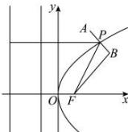

> [!faq]- 全练一本通解析
> **【答案】** A
>
> **【解析】**
> 解析:如图,
> 因为 $d_{2} = d_{1} + 2$ ，且 $A(2,4)$ 关于 $P$ 的对称点为 $B$
> 所以 $|PA|=|PB|$ ，抛物线焦点 $F(1,0)$
> 所以
> $$
> d _ {1} + d _ {2} + | A B | = 2 d _ {1} + 2 + 2 | P A | = 2 \left(d _ {1} + | P A |\right) + 2 = 2 \left(| P F | + | P A |\right) + 2
> $$
> $$
> \geq 2 \left| A F \right| + 2 = 2 \sqrt {1 7} + 2
> $$
> 当 P 在线段 AF 上时， $d_{1} + d_{1} + |AB|$ 取得最小值，且最小值为 $2\sqrt{17} + 2$ . 故选: A
> 
