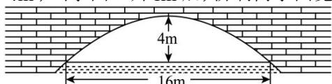

<!-- question-source:start -->
【45】（2024·全国高三专题练习）如图是一座抛物线形拱桥，当桥洞内水面宽16m时，拱顶距离水面4m，当水面上升1m后，桥洞内水面宽为（）

A. $4\mathrm{m}$ B. $4\sqrt{3}\mathrm{m}$ C. $8\sqrt{3}\mathrm{m}$ D. $12\mathrm{m}$

第七节 抛物线及其标准方程
<!-- question-source:end -->
