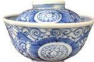

<!-- question-source:start -->
【47】清代青花瓷盖碗是中国传统茶文化的器物载体, 具有“温润”“淡远”“清新”的特征. 如图, 已知碗体和碗盖的内部均近似为抛物线形状, 碗盖深为3cm, 碗盖口直径为8cm, 碗体口直径为10cm, 碗体深6.25cm, 则盖上碗盖后, 碗盖内部最高点到碗底的垂直距离为(碗和碗盖的厚度忽略不计)( )

A. $5\mathrm{cm}$ B. $6\mathrm{cm}$ C. $7\mathrm{cm}$ D. $8.25\mathrm{cm}$
<!-- question-source:end -->
