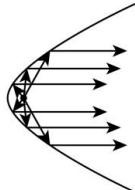

<!-- question-source:start -->
【48】探照灯、汽车前灯的反光曲面、手电筒的反光镜面、太阳灶的镜面等都是抛物镜面。灯泡放在抛物线的焦点位置，通过镜面反射就变成了平行光束，如图所示，这就是探照灯、汽车前灯、手电筒的设计原理。已知某型号探照灯反射镜的纵断面是抛物线的一部分，光源位于抛物线的焦点处，灯口直径是80cm，灯深40cm，则光源到反射镜顶点的距离为（）

A. $20 \mathrm{~cm}$ B. $10 \mathrm{~cm}$ C. $30 \mathrm{~cm}$ D. $40 \mathrm{~cm}$
<!-- question-source:end -->
