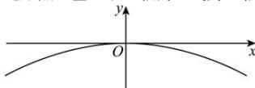

> [!faq]- 全练一本通解析
> **【答案】** C
>
> **【解析】**
> 解析:以抛物线的顶点为坐标原点,抛物线的对称轴为 y 轴,
> 过原点且垂直于 $y$ 轴的直线为 $x$ 轴建立如下图所示的平面直角坐标系，
> 
> 设抛物线的方程为 $x^{2}=-2py(p>0)$ ，由题意可知点 $(8,-4)$ 在抛物线上，所以， $64=-2p\times(-4)$ ，可得 p=8，所以，抛物线的方程为 $x^{2}=-16y$ ，当水面上升 1m 后，即当 y=-3 时， $x^{2}=48$ ，可得 $x=\pm4\sqrt{3}$ ，因此，当水面上升 1m 后，桥洞内水面宽为 $8\sqrt{3}m$ 。
>
> 故选 **C**.
