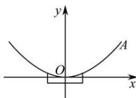

> [!faq]- 全练一本通解析
> **【解析】**
> $\frac{27}{8}$ 解析:如图,以抛物线的顶点为坐标原点,对称轴为y轴,建立直角坐标系,
> 依题意可得 A 的坐标为 $\left(\frac{9}{2},3\right)$ ,
> 设抛物线的标准方程为 $x^{2}=2py(p>0)$ ，则 $\frac{81}{4}=6p$ ，解得 $p=\frac{27}{8}$ .
> 故该抛物线的焦点到准线的距离为 $\frac{27}{8}cm$ .
> 
> 故答案为: $\frac{27}{8}$
