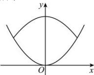

> [!faq]- 全练一本通解析
> **【答案】** C
>
> **【解析】**
> 解析:以碗体的最低点为原点,向上方向为 y 轴,建立直角坐标系,如图所示.
> 
> 设碗体的抛物线方程为 $x^{2}=2py\quad(p>0)$ ,
> 将点 $(5,6.25)$ 代入, 得 $5^{2}=2p\times6.25$ , 解得 p=2 , 则 $x^{2}=4y$
> 设盖上碗盖后, 碗盖内部最高点到碗底的垂直距离为 $h(\text{cm})$ ,
> 则两抛物线在第一象限的交点为 $(4, h - 3)$
> 代入到 $x^{2} = 4y$ ，解得 $4^{2} = 4(h - 3)$ ，解得 $h = 7$ .
>
> 故选 **C**
