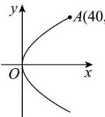

> [!faq]- 全练一本通解析
> **【答案】** B
>
> **【解析】**
> 解析: 在纵断面内, 以反射镜的顶点（即抛物线的顶点）为坐标原点,
> 过顶点垂直于灯口直径的直线为 $x$ 轴，建立直角坐标系，如图所示，
> 
> 由题意可得 $A(40,40)$ .
> 设抛物线的标准方程为 $y^{2}=2px(p>0)$
> 于是 $40^{2} = 2p\cdot 40$ ，解得 $p = 20$
> 所以抛物线的焦点到顶点的距离为 $\frac{p}{2} = 10$
> 即光源到反射镜顶点的距离为10cm.
>
> 故选 **B**.
