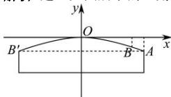

> [!faq]- 全练一本通解析
> **【答案】** 不能, 理由见解析.
>
> **【解析】**
> 建立如图所示的直角坐标系,
> 
> 设抛物线的方程为 $x^{2}=-2py(p>0)$ ,
> 由题意可知： $A(10,-6)$ ，把它代入方程中，得 $100=-2p\cdot(-6)\Rightarrow p=\frac{25}{3}$
> 所以方程为 $x^{2}=-\frac{50}{3}y$ ，而货轮宽 16m，
> 把 $x = 8$ 代入 $x^{2} = -\frac{50}{3} y$ 中，得 $y = -3.84$
> 点 B 离水面高度为 $10 - 3.84 = 6.16$ ，而吃水线上部分中央船体高 16m，所以不能通过桥孔。
