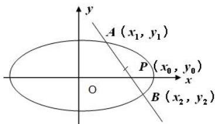

## 4. 解决椭圆中点弦问题的两种方法：

（1）根与系数关系法:联立直线方程和椭圆方程构成方程组,消去一个未知数,利用一元二次方程根与系数的关系以及中点坐标公式解决;

(2) 点差法: 利用交点在曲线上, 坐标满足方程, 将交点坐标分别代入椭圆方程, 然后作差, 构造出中点坐标和斜率的关系, 具体如下: 直线 $l$ (不平行于 $y$ 轴) 过椭圆 $\frac{x^2}{a^2} + \frac{y^2}{b^2} = 1 (a > b > 0)$ 上两点 $A$ 、 $B$ , 其中 $AB$ 中点为 $P(x_0, y_0)$ , 则有 $k_{AB} \cdot k_{OP} = -\frac{b^2}{a^2}$ 。

证明: 设 $A(x_{1}, y_{1})$ 、 $B(x_{2}, y_{2})$ ，则有 $\left\{\begin{aligned}\frac{x_{1}^{2}}{a^{2}}+\frac{y_{1}^{2}}{b^{2}}=1\\ \frac{x_{2}^{2}}{a^{2}}+\frac{y_{2}^{2}}{b^{2}}=1\end{aligned}\right.$

上式减下式得 $\frac{x_1^2 - x_2^2}{a^2} +\frac{y_1^2 - y_2^2}{b^2} = 0,\therefore \frac{y_1^2 - y_2^2}{x_1^2 - x_2^2} = -\frac{b^2}{a^2},$

$$
\therefore \frac {y _ {1} - y _ {2}}{x _ {1} - x _ {2}} \cdot \frac {y _ {1} + y _ {2}}{x _ {1} + x _ {2}} = \frac {y _ {1} - y _ {2}}{x _ {1} - x _ {2}} \cdot \frac {2 y _ {0}}{2 x _ {0}} = \frac {y _ {1} - y _ {2}}{x _ {1} - x _ {2}} \cdot \frac {y _ {0}}{x _ {0}} = - \frac {b ^ {2}}{a ^ {2}}, \therefore k _ {A B} \cdot k _ {O P} = - \frac {b ^ {2}}{a ^ {2}}
$$

特殊的: 直线 l （存在斜率）过椭圆 $\frac{y^{2}}{a^{2}} + \frac{x^{2}}{b^{2}} = 1$ （a > b > 0）上两点 A、B，线段 AB 中点为 $P(x_{0}, y_{0})$ ，则有 $k_{AB} \cdot k_{OP} = -\frac{a^{2}}{b^{2}}$ 。
