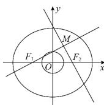

> [!faq]- 全练一本通解析
> **【答案】** AD
>
> **【解析】**
> 解析:由题意可得,椭圆的焦点分别为 $F_{1}(-1,0)$ ， $F_{2}(1,0)$ ，因为 $l_{1} \perp l_{2}$ ，所以点 $M$ 在以 $F_{1}F_{2}$ 为直径的圆上，则短半轴长为 $\sqrt{3} > 1$ ，所以点 $M$ 在椭圆 $\frac{x^2}{4} + \frac{y^2}{3} = 1$ 内，故 A 正确；由 $4x^{2} + 3y^{2} = 1$ 得 $\frac{x^2}{\frac{1}{4}} + \frac{y^2}{\frac{1}{3}} = 1$ ，则该椭圆的长半轴长为 $\frac{\sqrt{3}}{3} < 1$ ，所以点 $M$ 在椭圆 $4x^{2} + 3y^{2} = 1$ 外，故 D 正确。故选：AD
> 
