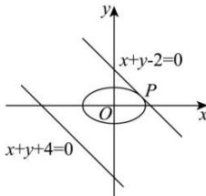

> [!faq]- 全练一本通解析
> **【解析】**
> $3\sqrt{2}$ $\left(\frac{3}{2},\frac{1}{2}\right)$ 解析:设与直线 $x+y+4=0$ 平行的直线 $x+y+m=0$ 与椭圆相切，
> 联立直线与椭圆方程得 $\left\{\begin{aligned}x+y+m=0\\ \frac{x^{2}}{3}+y^{2}=1\end{aligned}\right.$ ，消去 y，整理得 $4x^{2}+6mx+3m^{2}-3=0$ 由 $\Delta=(6m)^{2}-16(3m^{2}-3)=0$ ，即 $12m^{2}=48$ ，解得 $m=\pm2$ .
> 当 m=-2 时，直线 $x+y+4=0$ 与直线 $x+y-2=0$ 的距离 $d=\frac{\left|4-(-2)\right|}{\sqrt{1^{2}+1^{2}}} = 3\sqrt{2}$ 当 m=2 时，直线 $x+y+4=0$ 与直线 $x+y+2=0$ 的距离 $d=\frac{\left|4-2\right|}{\sqrt{1^{2}+1^{2}}}=\sqrt{2}$ 由 $3\sqrt{2}>\sqrt{2}$ 可知 m=-2 符合题意.
> 将 m=-2 代入 $4x^{2}+6mx+3m^{2}-3=0$ ，即 $(2x-3)^{2}=0$ ，可解得 $x=\frac{3}{2}$ ，
> 将 $x=\frac{3}{2}$ 代入 $x+y-2=0$ 可得 $y=\frac{1}{2}$ ，则点 P 的坐标为 $\left(\frac{3}{2},\frac{1}{2}\right)$ ，此时距离的最大值为 $3\sqrt{2}$ .
> 
> 答案为： $3\sqrt{2};\left(\frac{3}{2},\frac{1}{2}\right).$
