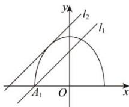

> [!faq]- 全练一本通解析
> **【答案】** $\left[\frac{\sqrt{2}}{2},\frac{\sqrt{6}}{2}\right)$
>
> **【解析】**
> 由题意， $y = \sqrt{1 - 2x^2}$ 表示交点在 $y$ 轴上的椭圆的上半部分，且左顶点为 $\left(\frac{\sqrt{2}}{2},0\right),$ $y = x + b$ 表示斜率为1的一组平行线，
> 
> 若直线与椭圆相切时，由 $\left\{\begin{aligned}y&=\sqrt{1-2x^{2}}\\ y&=x+b\end{aligned}\right.$ 得 $3x^{2}+2bx+b^{2}-1=0$ ，
> 所以 $\Delta=4b^{2}-4\times3\times(b^{2}-1)=0$ ，解得 $b=\frac{\sqrt{6}}{2}$ （负根舍去），当两图象有两个交点时，根据图象，
> 纵截距 b 的取值范围为： $\left[\frac{\sqrt{2}},\frac{\sqrt{6}}{2}\right)$ . 故答案为： $\left[\frac{\sqrt{2}}{2},\frac{\sqrt{6}}{2}\right)$
