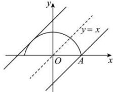

> [!faq]- 全练一本通解析
> **【答案】** B
>
> **【解析】**
> 解析: 设 $y=\sqrt{3-\frac{3x^{2}}{4}}$ , $y\geq0$ , 两边同平方得 $y^{2}=3-\frac{3x^{2}}{4}$ , 化简得 $\frac{x^{2}}{4}+\frac{y^{2}}{3}=1$ ( $y\geq0$ )，
> 则其所表示的图形为椭圆 $\frac{x^{2}}{4}+\frac{y^{2}}{3}=1$ 在 x 轴及上方部分，
> 则题目转化为直线 $y=x+b$ 与上述图形有交点，
> 设椭圆的右端点为 A，易得其坐标为 $(2,0)$ ，
> 
> 当直线 $y = x + b$ 与半椭圆相切时，显然由图得 $b > 0$ ，
> 联立 $\left\{ \begin{array}{l} \frac{x^2}{4} + \frac{y^2}{3} = 1 \\ y = x + b \end{array} \right.$ 得 $7x^{2} + 8bx + 4b^{2} - 12 = 0$ ，
> 则 $\Delta = (8b)^{2} - 4 \times 7 \times (4b^{2} - 12) = 0$ 化简得 $b^{2} = 7$ ，解得 $b = \sqrt{7}$ 或 $-\sqrt{7}$ （舍），
> 当直线 $y = x + b$ 经过点 $A(2,0)$ 时，得 $0 = 2 + b$ ，解得 $b = -2$ ，
> 则 $b \in [-2, \sqrt{7}]$ ，
>
> 故选 **B**.
