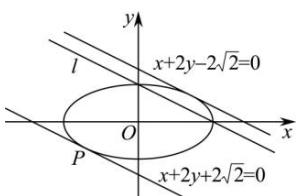

> [!faq]- 全练一本通解析
> **【解析】**
> $\frac{2\sqrt{10} + 2\sqrt{5}}{5}$ 解析：设与直线 $l: x + 2y - 2 = 0$ 平行的直线为 $x + 2y + m = 0$ ，
> 由 $\left\{ \begin{array}{l} x + 2y + m = 0 \\ \frac{x^2}{4} + y^2 = 1 \end{array} \right.$ ，消去 $x$ 整理得 $8y^{2} + 4my + m^{2} - 4 = 0$ ，
> 令 $\Delta = 0$ ，即 $16m^{2} - 32(m^{2} - 4) = 0$ ，解得 $m = \pm 2\sqrt{2}$ ，
> 所以直线 $x + 2y + 2\sqrt{2} = 0$ 、 $x + 2y - 2\sqrt{2} = 0$ 均与椭圆相切且与直线 $l: x + 2y - 2 = 0$ 平行，
> 因为点 $P$ 在此椭圆上运动，要求点 $P$ 到直线 $l$ 的距离的最大值，则当点 $P$ 在直线 $x + 2y + 2\sqrt{2} = 0$ 与椭圆的切点是点 $P$ 到直线 $l$ 的距离的最大，此时点 $P$ 到直线 $l$ 的距离的最大值为两平行线 $x + 2y + 2\sqrt{2} = 0$ 与直线 $l: x + 2y - 2 = 0$ 的距离 $d = \frac{|2\sqrt{2} + 2|}{\sqrt{1^2 + 2^2}} = \frac{2\sqrt{10} + 2\sqrt{5}}{5}$ 即点 $P$ 到直线 $l$ 的距离的最大值为 $\frac{2\sqrt{10} + 2\sqrt{5}}{5}$ .
> 
