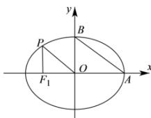

> [!faq]- 全练一本通解析
> **【答案】** C
>
> **【解析】**
> 解析：由已知得： $A(a,0),B(0,b)$ 将 $x = -c$ 代入椭圆 $\frac{x^2}{a^2} +\frac{y^2}{b^2} = 1$ 中， $\frac{c^2}{a^2} +\frac{y^2}{b^2} = 1$ 解得 $y = \pm \frac{b^2}{a}$ 因为 $A,B$ 分别是椭圆的右、上顶点，且 $AB / / OP$ ，所以 $P(-c,\frac{b^2}{a})$
> 
> 其中 $\overrightarrow{AB}=(-a,b),\overrightarrow{OP}=-c,\frac{b^{2}}{a}$ ，由 AB//OP 得： $-a\cdot\frac{b^{2}}{a}=-bc$ 解得 b=c，
> 由 $a^{2}=b^{2}+c^{2}$ 得： $a=\sqrt{2}c$ 所以椭圆 C 的离心率为 $e=\frac{c}{a}=\frac{\sqrt{2}}{2}$ .
>
> 故选 **C**.
