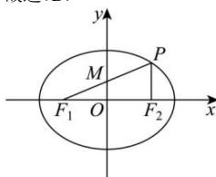

> [!faq]- 全练一本通解析
> **【答案】** D
>
> **【解析】**
> 解析： $c^{2}=9-5=4$ ，则 c=2，则 $F_{1}(-2,0),F_{2}(2,0)$ ，
> 设线段 $PF_{1}$ 的中点为 M，
> 因为 O 是 $F_{1}F_{2}$ 的中点，所以 $OM//PF_{2}$ ，可得 $PF_{2}\perp x$ 轴，令 x=c，
> 得 $\left|PF_{2}\right|=\frac{b^{2}}{a}=\frac{5}{3},\left|PF_{1}\right|=2a-\left|PF_{2}\right|=\frac{13}{3},\left|\frac{\left|PF_{2}\right|}{\left|PF_{1}\right|}=\frac{5}{13}\right.$ 故选:D.
> 
