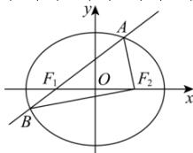

> [!faq]- 全练一本通解析
> **【答案】** A
>
> **【解析】**
> 解析:由椭圆的定义,可知
> $$
> \left| A B \right| + \left| A F _ {2} \right| + \left| B F _ {2} \right| = \left| A F _ {1} \right| + \left| A F _ {2} \right| + \left| B F _ {1} \right| + \left| B F _ {2} \right| = 4 a
> $$
> 
> 所以当 $\left|AB\right|$ 最小时， $\left|AF_{2}\right|+\left|BF_{2}\right|$ 最大，
> 由椭圆的性质得，过椭圆焦点的弦中垂直于长轴的弦最短，
> 当直线 AB 垂直于 x 轴时， $\left|AB\right|$ 取得最小值 $\frac{2b^{2}}{a}=\frac{12}{a}$ ，此时 $\left|AF_{2}\right|+\left|BF_{2}\right|=4a-\frac{12}{a}=8$ 由 a>0 解得 a=3，此时 C 的离心率 $e=\frac{c}{a}=\frac{\sqrt{a^{2}-b^{2}}}{a}=\frac{\sqrt{3^{2}-6}}{3}=\frac{\sqrt{3}}{3}$ .
>
> 故选 **A**.
