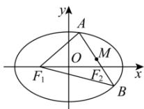

> [!faq]- 全练一本通解析
> **【解析】**
> $12\sqrt{2}$
> 解析:由题意知 $F_{1}(-3,0)$ , $F_{2}(3,0)$ ,
> 设 A, B 两点坐标分别为 $(x_{1}, y_{1}), (x_{2}, y_{2})$ , $\therefore \frac{x_{1}^{2}}{a^{2}} + \frac{y_{1}^{2}}{b^{2}} = 1$ , $\frac{x_{2}^{2}}{a^{2}} + \frac{y_{2}^{2}}{b^{2}} = 1$ ,
> 两式相减得 $\frac{(x_{1}+x_{2})(x_{1}-x_{2})}{a^{2}}+\frac{(y_{1}+y_{2})(y_{1}-y_{2})}{b^{2}}=0$
> 
> 由题意 $M$ 为 $AB$ 中点，
> 则 $x_{1} + x_{2} = 2, y_{1} + y_{2} = 2$ ，代入整理得 $\frac{y_1 - y_2}{x_1 - x_2} = -\frac{b^2}{a^2}$ 即由题意知 $k_{AB} = k_{MF_2} = \frac{1}{1 - 3} = -\frac{1}{2}$ 因此 $-\frac{b^2}{a^2} = -\frac{1}{2}$ 所以 $a^2 = 2b^2, c^2 = b^2$ ，由焦距为6，解得 $a = 3\sqrt{2}$ 由椭圆定义知 $\triangle AF_1B$ 的周长为 $\left|AF_1\right| + \left|BF_1\right| + \left|AB\right| = \left(\left|AF_1\right| + \left|AF_2\right|\right) + \left(\left|BF_1\right| + \left|BF_2\right|\right) = 4a = 12\sqrt{2}$ 故答案为： $12\sqrt{2}$
