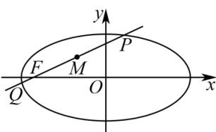

> [!faq]- 全练一本通解析
> **【答案】** （1） $\frac{x^2}{4} + \frac{y^2}{3} = 1$ （2） $\left(-1, \frac{1}{2}\right)$
>
> **【解析】**
> （1）依题意得： $c = 1$ $\because e = \frac{c}{a}$ ，即 $\frac{1}{2} = \frac{1}{a}$ ，解得 $a = 2$ $\because b^2 = a^2 - c^2$ ，解得 $b = \sqrt{3}$ $\therefore$ 椭圆 $C$ 的方程为 $\frac{x^2}{4} + \frac{y^2}{3} = 1$
> (2) 如图所示:
> 
> 设 $P(x_{1},y_{1}), Q(x_{2},y_{2})$ ，PQ 中点为 $M(x_{0},y_{0})$ ，
> 所以 $\left\{\begin{aligned}x_{1}+x_{2}&=2x_{0}\\ y_{1}+y_{2}&=2y_{0}\end{aligned}\right.$ 则 $k_{PQ}=\frac{y_{1}-y_{2}}{x_{1}-x_{2}}=\frac{3}{2}$
> 又 $P, Q$ 两点在椭圆 $\frac{x^2}{a^2} + \frac{y^2}{b^2} = 1 (a > b > 0)$ 上，可得 $\left\{ \begin{array}{l} \frac{x_1^2}{a^2} + \frac{y_1^2}{b^2} = 1 \\ \frac{x_2^2}{a^2} + \frac{y_2^2}{b^2} = 1 \end{array} \right.$ ，两式相减可得 $\frac{x_1^2 - x_2^2}{a^2} + \frac{y_1^2 - y_2^2}{b^2} = 0$ ，整理得 $\frac{y_1 - y_2}{x_1 - x_2} = -\frac{b^2(x_1 + x_2)}{a^2(y_1 + y_2)} = -\frac{3}{4} \times \frac{2x_0}{2y_0} = -\frac{x_0 \times 3}{y_0 \times 4} = \frac{3}{2}, \frac{x_0}{y_0} = -2$ ，①. 过点 $F\left(-\frac{4}{3}, 0\right)$ 斜率为 $\frac{3}{2}$ 的直线为 $y = \frac{3}{2}\left(x + \frac{4}{3}\right)$ . 因为 $M(x_0, y_0)$ 在直线上，故 $y_0 = \frac{3}{2}\left(x_0 + \frac{4}{3}\right)$ ，② 联立①②，解得 $x_0 = -1, y_0 = \frac{1}{2}$ 所以 $PQ$ 中点坐标为 $\left(-1, \frac{1}{2}\right)$ .
