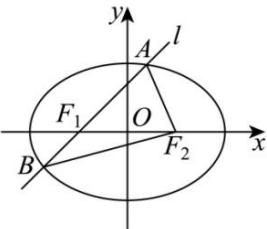

<!-- question-source:start -->
【54】（2024·天津高二阶段练习）如图所示，椭圆 $\frac{x^2}{16} +\frac{y^2}{9} = 1$ 的左、右焦点分别为 $F_{1},F_{2}$ ，一条直线 $l$ 经过 $F_{1}$ 与椭圆交于 $A,B$ 两点.

(1) 求焦点坐标, 焦距, 短轴长;

(2) 若直线 l 的倾斜角为 $45^{\circ}$ ，求 $\triangle ABF_{2}$ 的面积.
<!-- question-source:end -->
