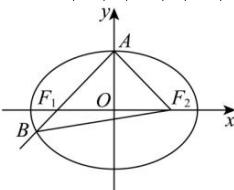

> [!faq]- 全练一本通解析
> **【解析】**
> 射线 $AF_{1}$ 的方程为 $y = \frac{b}{c} x + b = x + c$ ，
> 联立 $\left\{ \begin{array}{l} y = x + c \\ \frac{x^2}{2c^2} + \frac{y^2}{c^2} = 1 \end{array} \right.$ ，整理可得 $3x^{2} + 4cx = 0$ ，
> 解得 $x = 0$ 或 $x_B = -\frac{4}{3} c$ ，则 $y_B = -\frac{1}{3} c$ ，即 $B\left(-\frac{4}{3} c, -\frac{1}{3} c\right)$ 所以 $\left|AB\right| = \sqrt{\left(\frac{4}{3}c\right)^2 + \left(c + \frac{1}{3}c\right)^2} = \frac{4}{3}\sqrt{2} c = \frac{8}{3}$ ，解得 $c = \sqrt{2}$ ，则 $a = 2$ 所以 $\triangle ABF_2$ 的周长 $C_{\triangle ABF_2} = |AB| + |AF_2| + |BF_2| = |AF_1| + |BF_1| + |AF_2| + |BF_2| = 4a = 8.$
> 
