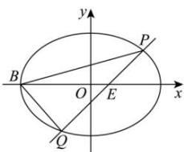

> [!faq]- 全练一本通解析
> **【答案】** （1） $\frac{x^{2}}{4}+\frac{y^{2}}{2}=1$ （2） $\pm1$
>
> **【解析】**
> （1）由题意
> 得： $F_{1}\left(-c,0\right)$ ， $F_{2}(c,0)$ ， $A(0,b)$ ， $\therefore\overline{AF_{1}}=\left(-c,-b\right)$ ， $\overline{AF_{2}}=\left(c,-b\right)$ ， $\therefore\overline{AF_{1}}\cdot\overline{AF_{2}}=-c^{2}+b^{2}=0$ ，即 $b^{2}=c^{2}$ ， $\therefore a^{2}=b^{2}+c^{2}=2b^{2}$ ;
> 当直线 l 过焦点且与 x 轴垂直时， $l: x = \pm c$ ，不妨令 l: x = c，
> 由 $\left\{\begin{aligned}&x=c\\ &\frac{x^{2}}{a^{2}}+\frac{y^{2}}{b^{2}}=1\end{aligned}\right.$ 得： $y=\pm\frac{b^{2}}{a}$ ， $\therefore\left|PQ\right|=\frac{2b^{2}}{a}=2$ 由 $\left\{\begin{aligned}&a^{2}=2b^{2}\\&\frac{2b^{2}}{a}=2\end{aligned}\right.$ 得： $\left\{\begin{aligned}&a=2\\&b=\sqrt{2}\end{aligned}\right.$ ，∴椭圆 C 的方程为： $\frac{x^{2}}{4}+\frac{y^{2}}{2}=1$
> 
> 由题意知: 直线 l 斜率不为 0, 可设 l: x = ty + 1,
> 由 $\left\{\begin{aligned}x &= ty + 1 \\ \frac{x^{2}}{4} + \frac{y^{2}}{2} &= 1\end{aligned}\right.$ 得: $(t^{2} + 2)y^{2} + 2ty - 3 = 0$ , 则 $\Delta = 4t^{2} + 12(t^{2} + 2) = 16t^{2} + 24 > 0$ ,
> 设 $P(x_{1},y_{1}), Q(x_{2},y_{2})$ ，则 $y_{1} + y_{2} = -\frac{2t}{t^{2} + 2}$ ， $y_{1}y_{2} = -\frac{3}{t^{2} + 2}$ ， $\therefore \left|y_{1}-y_{2}\right|=\sqrt{\left(y_{1}+y_{2}\right)^{2}-4y_{1}y_{2}}=\sqrt{\frac{4t^{2}}{\left(t^{2}+2\right)^{2}}+\frac{12}{t^{2}+2}}=\frac{2\sqrt{4t^{2}+6}}{t^{2}+2}$ 又 $B(-2,0)$ ，∴ $|EB|=1-(-2)=3$ $\therefore S_{aBPQ}=\frac{1}{2}|EB|\cdot|y_{1}-y_{2}|=\frac{3}{2}\times\frac{2\sqrt{4t^{2}+6}}{t^{2}+2}=\sqrt{10}$ ，解得： $t=\pm1$ ∴ 直线 l 的斜率 $k=\frac{1}{t}=\pm1$ .
