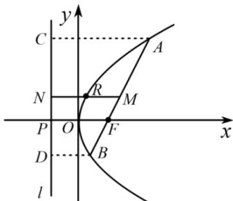
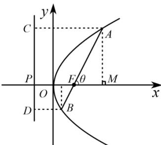
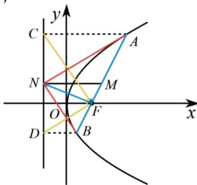

知识导学

如图，AB 为抛物线 $y^{2}=2px(p>0)$ 的焦点弦， $A(x_{1},y_{1}),B(x_{2},y_{2})$ ，焦点 $F\left(\frac{p}{2},0\right)$ ，准线 $l:x=-\frac{p}{2}$ ，准线与 x 轴交点为 P，作 $AC \perp l, BD \perp l$ 且 M，N 分别为线段 AB，CD 的中点，则有以下结论：

【结论1】焦点弦的坐标形式： $|AB| = x_{1} + x_{2} + p$

证明:根据抛物线定义,抛物线上的点到焦点距离等于到准线距离,可得 $|AF|=x_{1}+\frac{p}{2},|BF|=x_{2}+\frac{p}{2}$ ,故 $|AB|=|AF|+|BF|=x_{1}+x_{2}+p$

【结论 2】 $|MN|=\frac{|AB|}{2}$ ，以 AB 为直径的圆与准线相切

证明: $MN$ 是梯形 $ABCD$ 的中位线, 所以 $2|MN| = |AC| + |BD| = |AF| + |BF| = |AB|$ , 即 $|MN| = \frac{|AB|}{2}$ , 故以 $AB$ 为直径的圆与准线相切.

【结论3】焦半径公式： $|AF| = \frac{p}{1 - \cos\theta}, |BF| = \frac{p}{1 + \cos\theta}$ （ $\theta$ 为 $AB$ 的倾斜角角）证明：设准线 $l$ 交 $x$ 轴于 $P$ 点，过点 $A$ 作 $AM \perp x$ 轴于 $M$ ，作 $AC \perp l$ 于 $C$ .设 $d$ 为点 $A$ 到准线 $l$ 的距离，于是 $|AF| = |AC|$ .其中 $|PF| = p, |MF| = |AF| \cdot |\cos \theta |$ 故 $|AC| = |PF| + |FM| = p + |AF|\cos \theta ,|AF| = p + |AF|\cos \theta$ ，故 $|AF| = \frac{p}{1 - \cos\theta}$ 同理 $|BF| = \frac{p}{1 + \cos\theta}$

【结论4】焦点弦的角度形式： $\left|AB\right| = \frac{2p}{\sin^2\theta}$ （ $\theta$ 为 $AB$ 的倾斜角角）

证明:根据焦半径公式: $|AF|=\frac{p}{1-\cos\theta}$ , $|BF|= \frac{p}{1+\cos\theta}$ , 所以 $|AB|=|AF|+|BF|=\frac{2p}{1-\cos^{2}\theta}=\frac{2p}{\sin^{2}\theta}$ .

【结论 5】通径最短, 其长度为 2p

证明: 因为 $\left|AB\right|=\frac{2p}{\sin^{2}\theta}$ ，故当 $\theta=90^{\circ}$ ，即 $AB \perp x$ 轴时， $\sin\theta=1$ ，焦点弦取最小值 2p，即所有焦点弦中通径最短，其长度为 2p。

【结论6】 $\frac{1}{|AF|} +\frac{1}{|BF|} = \frac{2}{p}$ (定值）

证明:根据焦半径公式: $|AF|=\frac{p}{1-\cos\theta}$ , $|BF|= \frac{p}{1+\cos\theta}$ , 可得 $\frac{1}{|AF|}+\frac{1}{|BF|}=\frac{2}{p}$

【结论7】 $y_{1}y_{2} = -p^{2},x_{1}x_{2} = \frac{p^{2}}{4}$

证明: 当 AB 的斜率不存在时, 依题意 $x_{1}=x_{2}=\frac{p}{2}$ , 所以 $x_{1}x_{2}=\frac{p^{2}}{4}$ . 当 AB 的斜率存在时, 设为 k, 则 $AB:y=k\left(x-\frac{p}{2}\right)$ ，与 $y^{2}=2px$ 联立得 $k^{2}\left(x-\frac{p}{2}\right)^{2}=2px\Rightarrow k^{2}x^{2}-(k^{2}+2)px+\frac{k^{2}p^{2}}{4}=0$ . 所以 $x_{1}x_{2}=\frac{p^{2}}{4}$ . 因为 $x_{1}=\frac{y_{1}^{2}}{2p}, x_{2}=\frac{y_{2}^{2}}{2p}$ ，所以 $y_{1}^{2}y_{2}^{2}=p^{4}\Rightarrow y_{1}y_{2}=\pm p^{2}$ ，但 $y_{1}y_{2}<0$ ，所以 $y_{1}y_{2}=-p^{2}$ .
另证: 设直线 AB 的方程为: $x = my + \frac{p}{2}$ ，与 $y^{2} = 2px$ 联立，得 $y^{2} - 2pmy - p^{2} = 0$ ，故 $y_{1}+y_{2}=2pm,\quad y_{1}y_{2}=-p^{2}.$ 综上可知: $x_{1}x_{2}=\frac{p^{2}}{4},y_{1}y_{2}=-p^{2}.$

【结论8】面积公式： $S_{\triangle AOB} = \frac{p}{4}\left|y_1 - y_2\right| = \frac{p^2}{2\sin\theta}$

证明:根据结论7可得, $y_{1}+y_{2}=2pm$ , $y_{1}y_{2}=-p^{2}$ ，所以 $\left|y_{1}-y_{2}\right|=\sqrt{\left(y_{1}+y_{2}\right)^{2}-4y_{1}y_{2}}=\sqrt{4p^{2}m^{2}+4p^{2}}$ 故 $S_{\triangle AOB}=\frac{p}{4}\left|y_{1}-y_{2}\right|=\frac{p^{2}\sqrt{m^{2}+1}}{2}=\frac{p^{2}\sqrt{\frac{\cos^{2}\theta}{\sin^{2}\theta}+1}}{2}=\frac{p^{2}}{2\sin\theta}$

## 【结论9】三个垂直 $CF \perp FD$ , $NF \perp AB$ , $AN \perp BN$

证明： $C\left(-\frac{p}{2},y_1\right),D\left(-\frac{p}{2},y_2\right)$ 得 $\overrightarrow{FC} = (-p,y_1),\overrightarrow{FD} = (-p,y_2),\overrightarrow{FC}\cdot \overrightarrow{FD} = p^2 +y_1y_2,$

根据上条结论 $y_{1}y_{2} = -p^{2}$ ，得 $\overrightarrow{FC}\cdot \overrightarrow{FD} = 0$ ，故 $CF\perp FD$ 设 $N\left(-\frac{p}{2},\frac{y_1 + y_2}{2}\right)$ 得 $\overrightarrow{FN} = \left(-p,\frac{y_1 + y_2}{2}\right),\overrightarrow{BA} = (x_1 - x_2,y_1 - y_2),\overrightarrow{FN}\cdot \overrightarrow{BA} = -p(x_1 - x_2) + \frac{y_1^2 - y_2^2}{2},$

因为 $y_{1}^{2} = 2px_{1}$ ， $y_{2}^{2} = 2px_{2}$ 代入 $\overrightarrow{FN}\cdot \overrightarrow{BA} = -p(x_1 - x_2) + \frac{y_1^2 - y_2^2}{2} = 0$ ，故 $NF\perp AB$ $N\left(-\frac{p}{2},\frac{y_1 + y_2}{2}\right),\overrightarrow{NA} = \left(x_1 + \frac{p}{2},\frac{y_1 - y_2}{2}\right),\overrightarrow{NB} = \left(x_2 + \frac{p}{2},\frac{y_2 - y_1}{2}\right),$

$\overrightarrow{NA} \cdot \overrightarrow{NB} = x_{1} \cdot x_{2} + \frac{p}{2}(x_{1} + x_{2}) + \frac{p^{2}}{4} + \frac{2y_{1} \cdot y_{2} - y_{1}^{2} - y_{2}^{2}}{4}$ , 因为 $y_{1}^{2} = 2px_{1}, y_{2}^{2} = 2px_{2}, x_{1}x_{2} = \frac{p^{2}}{4}, y_{1}y_{2} = -p^{2}$ 代入原式化简得 $\overrightarrow{NA} \cdot \overrightarrow{NB} = 0$ , 故 $AN \perp BN$

## 【结论10】四个相切圆(均可通过上述结论证明)

①以 AB 为直径的圆必与准线相切.

②以 CD 为直径的圆与 AB 相切.

③以 BF 为直径的圆与 y 轴相切.

④以 AF 为直径的圆与 y 轴相切.
