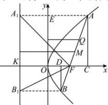

> [!faq]- 全练一本通解析
> **【解析】**
> （1）2p （2） $x_{1}+x_{2}+p$ （3） $\frac{p^{2}}{4}$ ; $-p^{2}$ （4）相切（5） $\frac{p}{1-\cos\alpha}$ ; $\frac{p}{1+\cos\alpha}$ ; $\frac{2p}{\sin^{2}\alpha}$ ; $\frac{2}{p}$ （6）y 轴
> 解析：（1）焦点坐标为 $\left(\frac{p}{2},0\right)$ ，所以当 $x=\frac{p}{2}$ 时， $y^{2}=2p\times\frac{p}{2}=p^{2}\Rightarrow\left|y\right|=p$ ，所以通径为 2p，
> （2）设 A, B 在抛物线的准线上的射影为 $A_{1}$ , $B_{1}$ ，根据抛物线的定义可知 $\left|AF\right|=\left|AA_{1}\right|=x_{1}+\frac{p}{2},\left|BF\right|=\left|BB_{1}\right|=x_{2}+\frac{p}{2}$ ，所以焦点弦
> 长： $\left|AB\right|=\left|AF\right|+\left|BF\right|=x_{1}+x_{2}+p,\left(\left|AF\right|=x_{1}+\frac{p}{2}\right)$ .
> （3）设直线方程为 $x=my+\frac{p}{2}$ ，代入 $y^{2}=2px$ ，可得 $y^{2}-2mpy-p^{2}=0$ ，
> 由于 $A(x_{1}, y_{1})$ ， $B(x_{2}, y_{2})$ $\therefore y_{1}y_{2}=-p^{2},\quad x_{1}\cdot x_{2}=\frac{y_{1}^{2}}{2p}\cdot\frac{y_{2}^{2}}{2p}=\frac{p^{2}}{4};$
> （4）由于过焦点的弦为 AB，AB 的中点是 M，M 到准线的距离是 d．而 A 到准线的距离 $d_{1}=|AF|$ ，B 到准线的距离 $d_{2}=|BF|$ ．又 M 到准线的距离 d 是梯形的中位线，故有 $d=\frac{|AF|+|BF|}{2}$ ，由抛物线的定义可得： $\frac{|AF|+|BF|}{2}=\frac{|AB|}{2}$ ，等于半径.
> （5）AB倾斜角为 $\alpha$ ，过 $A,B$ 分别作 $AC\bot x$ 轴， $BD\bot x$ 轴，所以 $\left|KC\right| = \left|KF\right| + \left|FC\right| = p + \left|AF\right|\cos \alpha = \left|AA_1\right| = \left|AF\right|\Rightarrow \left|AF\right| = \frac{p}{1 - \cos\alpha},$ 同理 $\left|KD\right| = \left|KF\right| - \left|FD\right| = p - \left|BF\right|\cos \alpha = \left|BB_1\right| = \left|BF\right|\Rightarrow \left|BF\right| = \frac{p}{1 + \cos\alpha},$ 故 $\frac{1}{\left|AF\right|} +\frac{1}{\left|BF\right|} = \frac{1 - \cos\alpha}{p} +\frac{1 + \cos\alpha}{p} = \frac{2}{p},$ （6）设 $AF$ 的中点为 $Q$ ， $AA_{1}$ 与 $y$ 轴交于点 $E$ ，由于 $\left|AF\right| = x_1 + \frac{p}{2},\left|AE\right| = x_1\left|OF\right| = \frac{p}{2},\therefore \left|AE\right| + \left|OF\right| = x_1 + \frac{p}{2} = \left|AF\right|$ 所以 $Q$ 到 $y$ 轴的距离为 $\frac{\left|AE\right| + \left|OF\right|}{2} = \frac{\left|AF\right|}{2}$ ，故以 $AF$ 为直径的圆与 $y$ 轴相切，同理可得 $BE$ 为直径的圆与 $y$ 轴相切
> 
