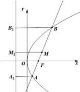

> [!faq]- 全练一本通解析
> **【答案】** A
>
> **【解析】**
> 解析: 分别过 A, M, B 作准线的垂线, 垂足分别为 $A_{1}$ , $M_{1}$ , $B_{1}$
> 
> 则 $\left|MM_{1}\right| = \frac{\left|AA_{1}\right| + \left|BB_{1}\right|}{2} = \frac{\left|AB\right|}{2} = 3$
>
> 故选 **A**
