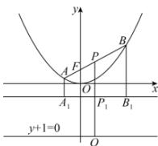

> [!faq]- 全练一本通解析
> **【答案】** C
>
> **【解析】**
> $$
> x ^ {2} = y
> $$
> $$
> y = - \frac {1}{4}
> $$
> 过 A, B 作准线的垂线, 垂足分别为 $A_{1}, B_{1}$ , 设 AB 的中点为 P, 过 P 作直线 y = -1 的垂线, 垂足为 Q, 交准线于 $P_{1}$ , 如图所示:
> 
> 根据抛物线的定义可知， $|AA_{1}| + |BB_{1}| = |AB| = 4$ ，
> 所以 $\left|PP_{1}\right|=\frac{1}{2}(\left|AA_{1}\right|+\left|BB_{1}\right|)=2$ 所以 $\left|PQ\right|=\left|PP_{1}\right|+\frac{3}{4}=\frac{11}{4}$ ，即 AB 的中点到直线 $y+1=0$ 的距离是 $\frac{11}{4}$ .
>
> 故选 **C**
