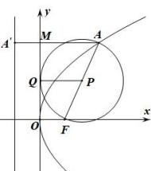

> [!faq]- 全练一本通解析
> **【答案】** C
>
> **【解析】**
> 解析:如图,取 AF 中点 P, 以 P 为圆心, AF 为直径作圆, 与 y 相切于点 Q, 连接 PQ, 证明如下: 因为 P, Q 为 AF, OM 中点, 所以 $\left|PQ\right|=\frac{1}{2}\left(\left|OF\right|+\left|AM\right|\right)$ ，又 $\left|OF\right|=\left|A'M\right|=\frac{p}{2}$ ，所以 $\left|PQ\right|=\frac{1}{2}\left(\left|A'M\right|+\left|AM\right|\right)=\frac{1}{2}\left|AA'\right|$ ，由抛物线定义可知， $\left|PQ\right|=\frac{1}{2}\left|AA'\right|=\frac{1}{2}\left|AF\right|$ ，所以 $\left|PQ\right|$ 为圆 P 的半径，即以 AF 为直径的圆与 y 轴相切.故选:C
> 
