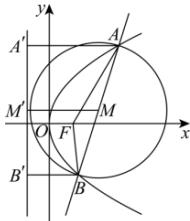

> [!faq]- 全练一本通解析
> **【答案】** A
>
> **【解析】**
> 解析: 设 AB 中点为 M, 过 A, M, B 作准线的垂线, 垂足分别为 $A'$ , $M'$ , $B'$ ,
> 又该直线不经过抛物线的焦点, 则
> $$
> M M ^ {\prime} = \frac {1}{2} \left(A A ^ {\prime} + B B ^ {\prime}\right) = \frac {1}{2} (A F + B F) > \frac {1}{2} A B
> $$
> 所以线段 AB 为直径的圆与该抛物线的准线的位置关系是相离.
> 故选:A.
> 
