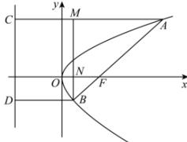
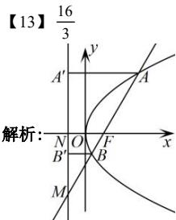

> [!faq]- 全练一本通解析
> **【答案】** $\frac{4}{5}$
>
> **【解析】**
> 若角 $\alpha$ 为锐角, 如图,
> 
> 设 $A$ 、 $B$ 两点在准线上的射影分别为 $C$ 、 $D$ .
> 过 $B$ 作 $BM \perp AC$ 于 $M$ . 则有 $AC = AF$ ， $BD = BF$ 设 $\left|AF\right| = 4\left|BF\right| = 4m$ ，则 $AM = 3m.AB = 5m$ . 由勾股定理可知： $\left|BM\right| = \sqrt{\left(5m\right)^2 - \left(3m\right)^2} = 4m$ 则 $\sin \alpha = \sin \angle MAB = \frac{BM}{AB} = \frac{4}{5}$ . 若角 $\alpha$ 为钝角，由对称性可知 $\sin \alpha = \frac{4}{5}$ 故答案为： $\frac{4}{5}$
> 
