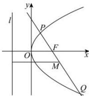

> [!faq]- 全练一本通解析
> **【解析】**
> 3
> 解析: 方法一: 当 PQ 斜率为 0 时, 过 F 的直线与抛物线只有 1 个交点, 不合要求, 舍去,
> 设 $PQ: x=my+\frac{p}{2}, P(x_{1},y_{1}), Q(x_{2},y_{2}), y_{1}>0, y_{2}<0$ ,
> 由 $x=my+\frac{p}{2}$ 与 $y^{2}=2px$ 联立, 得 $y^{2}-2pmy-p^{2}=0$ , 所以 $y_{1} + y_{2} = 2pm, y_{1}y_{2} = -p^{2}$ .
> 由 $\overrightarrow{FQ} = -3\overrightarrow{FP}$ ，得 $y_{2} = -3y_{1}$ ，代入 $y_{1}y_{2} = -p^{2}$ ，得 $-3y_{1}^{2} = -p^{2}$ ，
> 故 $y_{1}^{2}=\frac{1}{3}p^{2}, y_{2}^{2}=3p^{2}$ .
> 因为 M 为 PQ 的中点, 所以 M 点的横坐标为 $\frac{x_{1}+x_{2}}{2}$ ,
> 因为点 M 到 l 的距离为 4, 所以 $\frac{x_{1}+x_{2}}{2}+\frac{p}{2}=4$ ,
> 
> 即 $\frac{y_1^2 + y_2^2}{2p} + \frac{p}{2} = 4$ ，故 $\frac{p + \frac{3p}{6}}{2} + \frac{p}{2} = 4$ ，解得 $p = 3$ ；方法二：设 $PQ$ 的倾斜角为 $\theta$ ，则 $\left|PF\right| = \frac{p}{1 - \cos\theta}, \left|QF\right| = \frac{p}{1 + \cos\theta}$ ，由 $\overrightarrow{FQ} = -3\overrightarrow{FP}$ 得 $\left|QF\right| = 3\left|PF\right|$ ，即 $\frac{p}{1 + \cos\theta} = \frac{3p}{1 - \cos\theta}$ ，解得 $\cos\theta = -\frac{1}{2}$ ，则 $\sin\theta = \sqrt{1 - \cos^2\theta} = \frac{\sqrt{3}}{2}$ ，由点 $M$ 到 $l$ 的距离为 4，得 $PQ = 2 \times 4 = 8$ ，即 $\frac{2p}{\sin^2\theta} = 8$ ，所以 $p = 4\sin^2\theta = 3$ 。故答案为：3
