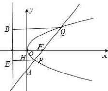

> [!faq]- 全练一本通解析
> **【答案】** B
>
> **【解析】**
> 解析:如图所示,
> 
> 分别过点 P, Q 作抛物线 C 的准线的垂线 BQ, PE，垂足分别为 B, E，设 PE 与 y 轴交于点 H，
> 因为点 P 为线段 FA 的中点，
> 则 $\left|PH\right|=\frac{1}{2}\left|OF\right|=\frac{p}{4},\left|EH\right|=\frac{p}{2}$ 则 $\left|PF\right|=\left|PE\right|=\frac{p}{4}+\frac{p}{2}=\frac{3p}{4}$ 根据抛物线的焦点弦性质： $\frac{1}{\left|QF\right|}+\frac{1}{\left|PF\right|}=\frac{2}{p}$ ，
> 所以 $\frac{1}{2}+\frac{1}{\frac{3p}{4}}=\frac{2}{p}$ ，解得 $p=\frac{4}{3}$ . 故选：B
> 解析:由题意 p=2，设直线 AB 的倾斜角为 $\theta\left(\theta\in(0,\pi)\right)$ ，如下图，直线 $A_{1}P$ 为抛物线的准线，点 F 为抛物线的焦点， $AA_{1}\perp A_{1}P$ ， $AC\perp x$ 轴与点
