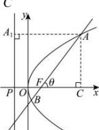

> [!faq]- 全练一本通解析
> **【答案】** C
>
> **【解析】**
> 
> 根据抛物线的定义可
> 得， $\left|AF\right|=\left|AA\right|_{1}=\left|PC\right|=\left|PF\right|+\left|PC\right|=\left|PF\right|+\left|AF\right|\cos\theta=p+\left|AF\right|\cdot\cos\theta$ $\therefore\left|AF\right|=\frac{p}{1-\cos\theta},\theta\in(0,\pi)$ $\therefore\left|AF\right|=\frac{2}{1-\cos\theta}$ ，同理可得， $\left|BF\right|=\frac{2}{1+\cos\theta}$ ，
> 则 $\left|AF\right|\cdot\left|BF\right|=\frac{2}{1-\cos\theta}\times\frac{2}{1+\cos\theta}=\frac{4}{\sin^{2}\theta}\geq4$ 。
>
> 故选 **C**.
