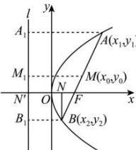

> [!faq]- 全练一本通解析
> **【答案】** A
>
> **【解析】**
> 解析： $C:y^{2}=2px(p>0)$ 的焦点 $F\left(\frac{p}{2},0\right)$ ，因为 $\left|AF\right|\cdot\left|BF\right|=2\left|AB\right|$ ，且直线 AB 经过焦点 F，故 $\left|AB\right|=\left|AF\right|+\left|BF\right|$ 代入得： $\left|AF\right|\cdot\left|BF\right|=2\left(\left|AF\right|+\left|BF\right|\right)$ 化简得： $\frac{1}{\left|AF\right|}+\frac{1}{\left|BF\right|}=\frac{1}{2}$ ，
> 设直线 AB 的倾斜角为 $\theta$ ，则过点 B 作 $BN\perp x$ 轴于 N，x 轴与准线交于 $N'$ ，所以 $\left|BF\right|=\left|BB_{1}\right|=p-\left|BF\right|\cos\theta\nRightarrow\left|BF\right|=\frac{p}{1+\cos\theta}$ ，同理可得则抛物线的焦半径公式得： $\left|AF\right|=\frac{p}{1-\cos\theta}$ ，故 $\frac{1}{\left|AF\right|}+\frac{1}{\left|BF\right|}=\frac{2}{p}=\frac{1}{2}$ ，解得 p=4，故抛物线的标准方程是 $y^{2}=8x$ ，故选：A.
> 
