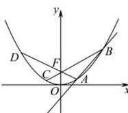

> [!faq]- 全练一本通解析
> **【答案】** D
>
> **【解析】**
> 解析: 连接 BF, AF, 延长交抛物线于 C, D 两点, 不妨假设 A 在 B 的下方,
> 根据对称性可知, FB, FA 与 y 轴正方向所夹的角为 $\frac{\pi}{3}$ , $\frac{2\pi}{3}$ ,
> 因为 p=2 ，所以 $BF=\frac{p}{1-\cos\frac{\pi}{3}}=4$ , $AF=\frac{p}{1-\cos\frac{2\pi}{3}}=\frac{4}{3}$ .
> 由余弦定理, 可得 $AB = \sqrt{16 + \frac{16}{9} - 2 \times 4 \times \frac{4}{3} \times \cos \frac{\pi}{3}} = \frac{4\sqrt{7}}{3}$ . 故选: D
> 
