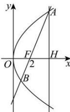

> [!faq]- 全练一本通解析
> **【答案】** C
>
> **【解析】**
> 解析：
> 
> 方法一: 结论①: 过点 A 作 x 轴的垂线, 垂足为 H, 则 $\angle AFH = \frac{\pi}{3}$ , 所以 $\left|FH\right| = \left|AF\right| \cos \angle AFH = 4$ , $\left|AH\right|=\left|AF\right|\sin\angle AFH=4\sqrt{3}$ 因为经过点 F 且斜率为 $\sqrt{3}$ 的直线 l 与抛物线 C 交于 A, B 两点（点 A 在第一象限）， $\left|AF\right|=8$ ，
> 所以 $A\left(\frac{p}{2}+4,4\sqrt{3}\right)$ ，由点 A 在抛物线上，得 $\left(4\sqrt{3}\right)^{2}=2p\left(\frac{p}{2}+4\right)$ ，解得 p=4 或 p=-12 （舍去），故①正确.
> 结论②: 由①得抛物线的方程为 $y^{2}=8x,F(2,0)$ ，直线 AB 的方程为 $y=\sqrt{3}(x-2)$ ，
> 将其与抛物线方程联立，得 $3x^{2}-20x+12=0$ ，得 x=6 或 $x=\frac{2}{3}$ ，所以 $x_{B}=\frac{2}{3}$ ，
> 故 $\left|BF\right|=x_{B}+\frac{p}{2}=\frac{2}{3}+2=\frac{8}{3}$ ，故 $\left|AF\right|=3\left|BF\right|$ ，②错误.
> 结论③: 由 $\left|AF\right|=8,\left|BF\right|=\frac{8}{3}$ ，得 $\frac{1}{\left|AF\right|}+\frac{1}{\left|BF\right|}=\frac{1}{2}$ ，故③正确.
> 结论④: 由 $x_{B}=\frac{2}{3}$ ，得 $y_{B}=-\frac{4\sqrt{3}}{3}$ ，
> 故 $S_{\triangle AOB}=\frac{1}{2}\left|OF\right|(y_{A}-y_{B})=4\sqrt{3}-\left(-\frac{4\sqrt{3}}{3}\right)=\frac{16\sqrt{3}}{3}$ ，故④正确.
> 所以正确结论的个数为 3.
> 故选:C.
> 方法二: 由直线的斜率为 $\sqrt{3}$ 可得直线 l 的倾斜角为 $\frac{\pi}{3}$ .
> - **对于①**：$\left|AF\right|=\frac{p}{1-\cos\frac{\pi}{3}}=8$ ，得 p=4，故①正确.
> - **对于②**：结合①可知， $\left|BF\right|=\frac{p}{1+\cos\frac{\pi}{3}}=\frac{4}{1+\cos\frac{\pi}{3}}=\frac{8}{3}$ ，故 $\left|AF\right|=3\left|BF\right|$ ，②错误.
> - **对于③**：$\frac{1}{\left|AF\right|}+\frac{1}{\left|BF\right|}=\frac{2}{p}=\frac{1}{2}$ ，故③正确.
> - **对于④**：$S_{\triangle AOB} = \frac{p^{2}}{2\sin\frac{\pi}{3}} = \frac{16}{2\sin\frac{\pi}{3}} = \frac{16\sqrt{3}}{3}$ ，故④正确.
> 所以正确结论的个数为 3.
>
> 故选 **C**.
