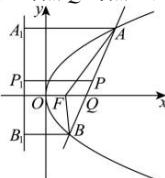

> [!faq]- 全练一本通解析
> **【答案】** D
>
> **【解析】**
> 解析: 设抛物线的焦点为 F, 连接 AF, BF, 分别过 A, B, P 作抛物线准线 $x=-\frac{3}{4}$ 的垂线,
> 垂足分别为 $A_{1}, B_{1}, P_{1}$ ,
> 则 $\left|PP_{1}\right|=\frac{\left|AA_{1}\right|+\left|BB_{1}\right|}{2}=\frac{\left|AF\right|+\left|BF\right|}{2}.$ 因为 $|AF|+|BF|\geq|AB|=4$ ，所以 $\left|PP_{1}\right|\geq\frac{\left|AB\right|}{2}=2$ 当且仅当 A, F, B 三点共线时取等号，
> 此时点 O 与点 F 重合，且点 P 到 y 轴的距离取得最小值.
> 
> 解法一: 设此时直线 AB 的倾斜角为 $\alpha(0<\alpha<\pi)$ ，易知 $F\left(\frac{3}{4},0\right)$ ，
> 则 $\left|AA_{1}\right|=\frac{3}{2}+\left|AF\right|\cdot\cos\alpha$ 又 $\left|AA_{1}\right|=\left|AF\right|$ ，所以 $\left|AF\right|=\frac{\frac{3}{2}}{1-\cos\alpha}$ ，同理 $\left|BF\right|=\frac{\frac{3}{2}}{1+\cos\alpha}$ ，
> 故 $\left|AB\right|=\left|AF\right|+\left|BF\right|=\frac{\frac{3}{2}}{1-\cos\alpha}+\frac{\frac{3}{2}}{1+\cos\alpha}=\frac{3}{\sin^{2}\alpha}$ .
> 由 $|AB|=4$ ，解得 $\sin\alpha=\frac{\sqrt{3}}{2}$ ，故 $\cos\alpha=\pm\frac{1}{2}$ .
> 因为 $|AQ|=\lambda|QB|$ ，故 $\lambda=\frac{|AF|}{|BF|}=\frac{1+\cos\alpha}{1-\cos\alpha}$ .
> 当 $\cos\alpha=\frac{1}{2}$ 时， $\lambda=3$ ;
> 当 $\cos\alpha=-\frac{1}{2}$ 时， $\lambda=\frac{1}{3}$ .
> 故 $\lambda$ 的值为 3 或 $\frac{1}{3}$ .
> 解法二: 易知 $F\left(\frac{3}{4},0\right)$ ，可设直线 AB 的方程为 $x=my+\frac{3}{4}$ ，
> 联立得 $\left\{\begin{aligned}&x=my+\frac{3}{4}\\ &y^{2}=3x\end{aligned}\right.$ ，消去 x 可得 $y^{2}-3my-\frac{9}{4}=0$ 。
> 设 $A(x_{1},y_{1})$ ， $B(x_{2},y_{2})$ ，其中 $y_{1}>0$ ， $y_{2}<0$ ，则 $y_{1}+y_{2}=3m$ ， $y_{1}y_{2}=-\frac{9}{4}$ .
> 由 $\left|AB\right|=x_{1}+x_{2}+\frac{3}{2}=\frac{1}{3}\left(y_{1}^{2}+y_{2}^{2}\right)+\frac{3}{2}=\frac{1}{3}\left[\left(y_{1}+y_{2}\right)^{2}-2y_{1}y_{2}\right]+\frac{3}{2}$ $=\frac{1}{3}\times\left[(3m)^{2}-2\times\left(-\frac{9}{4}\right)\right]+\frac{3}{2}=3m^{2}+3=4$ ，可得 $m=\pm\frac{\sqrt{3}}{3}$ .
> 由 $|AQ|=\lambda|QB|$ ，知 $\lambda=\left|\frac{y_{1}}{y_{2}}\right|$ .
> 当 $m=\frac{\sqrt{3}}{3}$ 时，可得 $y_{1}=\frac{3\sqrt{3}}{2}$ ， $y_{2}=-\frac{\sqrt{3}}{2}$ ，则 $\lambda=\left|\frac{y_{1}}{y_{2}}\right|=3$ ；
> 当 $m=-\frac{\sqrt{3}}{3}$ 时，可得 $y_{1}=\frac{\sqrt{3}}{2}$ ， $y_{2}=-\frac{3\sqrt{3}}{2}$ ，则 $\lambda=\left|\frac{y_{1}}{y_{2}}\right|=\frac{1}{3}$ .
> 故 $\lambda$ 的值为 3 或 $\frac{1}{3}$ .
>
> 故选 **D**.
